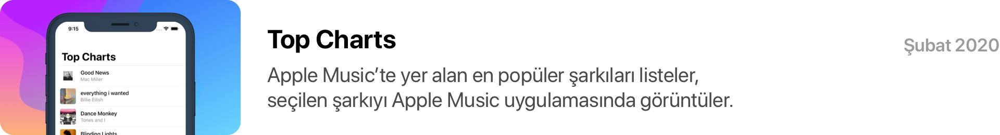

# Adım Adım Kodla

&nbsp;

### Adım Adım Kodla Nedir?

Adım Adım Kodla, kendi iPhone uygulamasını geliştirmek isteyen kişilerin, her ay yayımlanan bir projeyi, geliştirme kılavuzundaki adımları takip ederek Swift ile kodlayabilmesini sağlayan bir eğitim serisidir.

*iOS, Mac, Apple TV ve Apple Watch uygulamaları geliştirmek için Apple tarafından oluşturulmuş güçlü ve kullanıcı dostu bir programlama dili.*

&nbsp;

### Her Ay Yeni Bir Uygulama

Her ayın ilk haftası TurkishKit sosyal medyalarında yayınlanan projeler ile farklı uygulama konseptlerini Swift dilinin büyüleyici dünyasında keşfet. Hemen [takip et](target="https://twitter.com/turkishkit"), yeni projelerden anında haberdar ol! 

*İleri seviye geliştiriciler, kodlama macerası yeni başlamış kişilerin çeşitli problemlerle baş edebilmeyi ve algoritmik düşünce yapısını öğrenebilmeleri için her ay yeni bir proje üstünde çalışmalarını öneriyor.*

&nbsp;

### Harakete Geç

1. Bu ayın başlangıç setini [hemen indir](https://google.com).
2. Geliştirme kılavuzunundaki adımları takip et. Projeni geliştir.
3. Uygulamanı #turkishkit etiketi ile paylaş, sosyal medyalarda sana yer verelim.

&nbsp;

## Projeler

&nbsp;

Copyright © 2020 TurkishKit — Tüm Hakları Saklıdır

